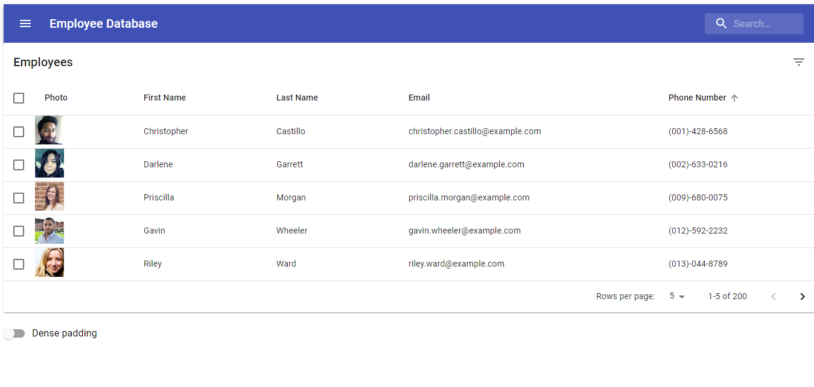

# Employee Directory 

                                                                                            
 ## Description
        
This is an exercise in using React and Material Ui to create and deploy a basic webpage consisting of a directory of employees, sourced from an API.

            
## Table of Contents

- [Installation](#Installation)
- [Usage](#Usage)
- [Credits](#credits)
- [license](#license)
- [Badges](#Badges)
- [Contributing](#Contributing)
- [Tests](#Tests)
            
            
## Installation

Prerequisites for installation are Node and React 
        

## Usage 
        
Run npm install in CLI, then npm start
[Deployed link](https://dyoder838.github.io/Employee-Directory/)
           

            
## Credits

### Collaborators
            
none 

### Third Party Assets
            
none

### Tutorials 
            
none

            
## License

This project is using the standard MIT License. See [LICENSE](.LICENSE) for Terms and Conditions.

## Badges

            
## Contributing

[Contributor Covenant](.CODE_OF_CONDUCT.md)
            
            
## Tests

none at this time